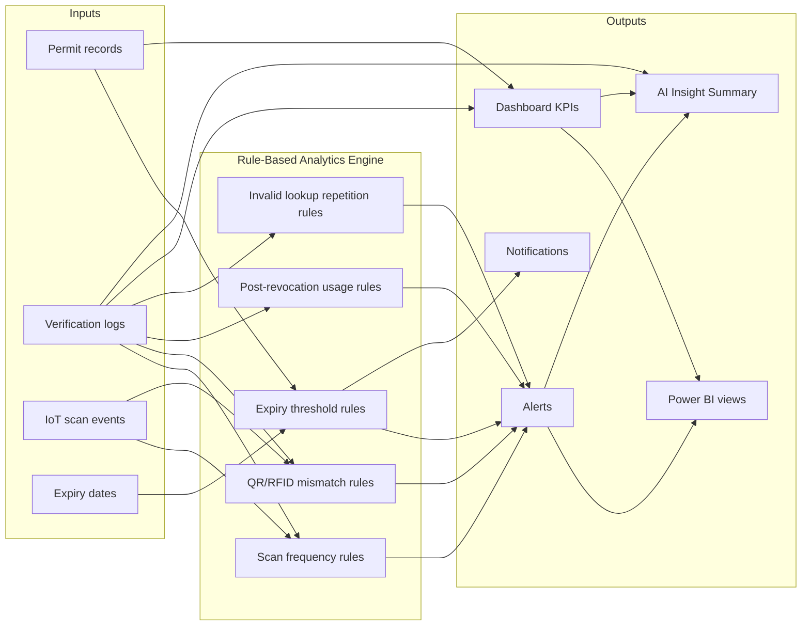

# DigiPermit — AI & Analytics Workflow (IS3)

**Module:** Information Systems 3 — AI & Analytics  
**Approach:** Rule-based analytics (primary) + optional AI-assisted executive summary (secondary)

---

## 1. AI Workflow Diagram



---

## 2. Rule-Based Logic (Implemented)

| Rule ID | Condition | Action | Priority |
|---------|-----------|--------|----------|
| R-EXP | Permit expiry within threshold days | Notification to FN + org officer | normal→high |
| R-EXP0 | Permit expired | Alert + status update | high |
| R-SCAN | >10 scans/hour on same permit | Mark suspicious + alert | high |
| R-QR | QR value mismatch | Result: suspicious + alert | critical |
| R-RFID | RFID tag mismatch | Result: suspicious + alert | critical |
| R-REV | Revoked permit scanned | Alert: revoked_permit_scan | critical |
| R-INV | >5 invalid lookups/hour by officer | Alert: repeated_invalid_attempts | high |

**Implementation:** `verificationService.js`, `expiryCheckJob.js`, `alertService.js`

---

## 3. AI-Assisted Layer (Executive Summary)

**Endpoint:** `GET /api/analytics/ai-insights`  
**Purpose:** Generate a human-readable compliance summary for managers/auditors without requiring manual report writing.

**Logic (deterministic template — no external API required for demo):**

1. Aggregate counts from `analytics/summary`
2. Pull open alerts and suspicious activity
3. Compose structured insight text with recommendations

Example output:

```json
{
  "summary": "Platform monitoring 7 foreign nationals across 3 organisations.",
  "risk_level": "elevated",
  "insights": [
    "2 permits are expired — immediate HR follow-up required.",
    "1 revoked permit was scanned at a checkpoint — investigate.",
    "Study visa SV-2024-METRO-002 expires within 14 days."
  ],
  "recommendations": [
    "Prioritise renewal for expiring work visas at Acme Global Industries.",
    "Review verification logs for suspicious QR/RFID mismatches."
  ]
}
```

> For production, this layer could call an LLM API. For academic submission, the rule-based template demonstrates the **AI workflow** and decision-support concept.

---

## 4. Power BI Integration

| View | Analytics purpose |
|------|-------------------|
| `vw_permit_status_summary` | Permit distribution donut chart |
| `vw_expiring_permits` | Expiry forecast table |
| `vw_verification_summary` | Verification trends by scan type |
| `vw_alert_summary` | Alerts by priority |
| `vw_employer_compliance` | Employer compliance scorecard |
| `vw_university_compliance` | University student visa compliance |
| `vw_iot_scan_summary` | IoT activity timeline |

See [POWER-BI-SETUP.md](./POWER-BI-SETUP.md) for connection steps.

---

## 5. Executive Decision Support

**Decision makers:** HR managers, university international office, compliance auditors  
**Questions answered:**

- How many permits expire in the next 30 days?
- Which organisations have the highest expired-permit count?
- Are verification failures increasing week-on-week?
- Which IoT devices report the most suspicious scans?

---

## Important limitation

DigiPermit analytics support compliance monitoring only. AI outputs are advisory and do not constitute legal immigration decisions.
