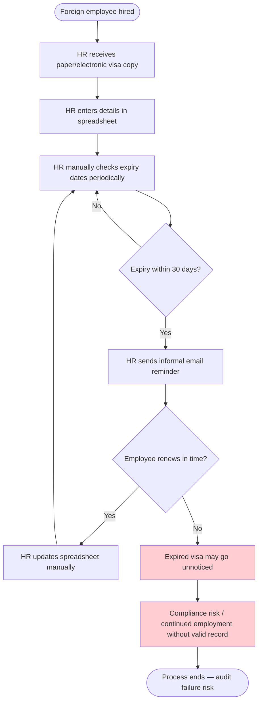
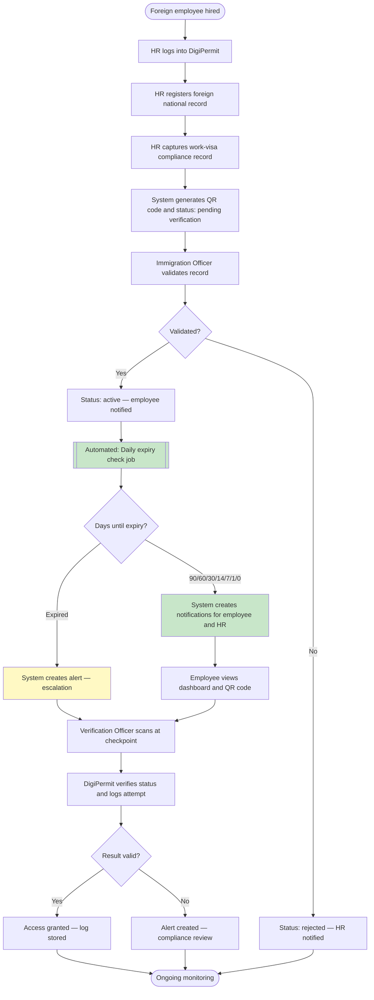
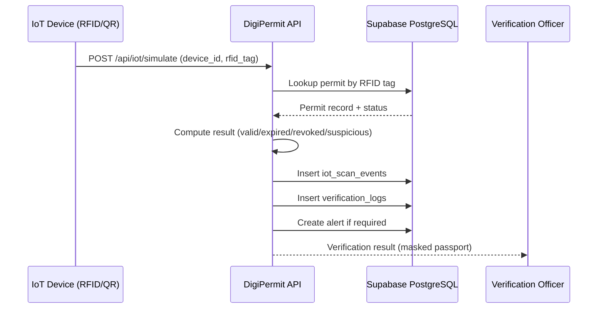

# DigiPermit — BPMN 2.0 Process Models (IS3)

**Project:** DigiPermit — Foreign-National Visa and Permit Compliance Monitoring  
**Module:** Information Systems 3 (IS3) — Business Process Automation  
**Bottleneck automated:** Manual expiry tracking and missed renewal notifications

---

## 1. As-Is Process (Manual Workflow)

**Process name:** Manual Foreign-Employee Work-Visa Compliance Tracking  
**Primary actor:** Employer HR / Compliance Officer  
**Pain points:** Spreadsheets, missed expiry dates, no verification audit trail, delayed renewal action

### As-Is bottlenecks identified

| # | Bottleneck | Impact |
|---|------------|--------|
| B1 | Manual spreadsheet expiry checks | Dates overlooked; no automated reminders |
| B2 | No central verification at gate/checkpoint | Security cannot confirm permit validity in real time |
| B3 | No audit log of verification attempts | Cannot investigate suspicious usage |
| B4 | Disconnected employee self-service | Foreign nationals unaware of expiry timeline |

**Selected bottleneck for automation (To-Be):** **B1 — Manual expiry monitoring**

---

## 2. To-Be Process (DigiPermit Automated Workflow)

**Process name:** Digital Permit Compliance Monitoring via DigiPermit  
**Automated elements:** Scheduled expiry job, in-app notifications, verification API, audit logs, alerts

### Automation mapping

| As-Is bottleneck | To-Be automation | DigiPermit component |
|------------------|------------------|----------------------|
| Manual expiry checks | Daily cron job at 06:00 UTC | `expiryCheckJob.js` |
| No employee visibility | Foreign National dashboard + notifications | Ionic FN pages + `notifications` table |
| No verification audit | Verification logs on every scan | `verificationService.js` + `verification_logs` |
| Suspicious usage undetected | Rule-based activity detection | `suspiciousActivityService` rules in verification flow |

---

## 3. Secondary To-Be Process: IoT Verification at Checkpoint

---

## Important limitation

DigiPermit is a compliance-monitoring platform. It does not issue official visas or replace government immigration authorities.
