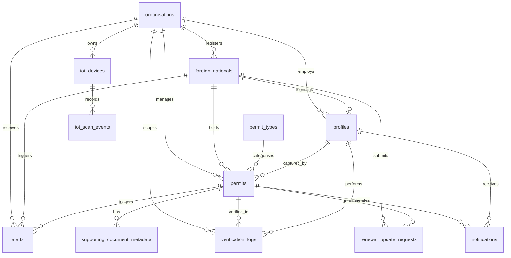

# DigiPermit — 3NF Entity Relationship Diagram (IS3)

**Module:** Information Systems 3 — Relational Data Integrity  
**Normalisation:** Third Normal Form (3NF) — no transitive dependencies; attributes depend only on primary keys.

---

## 1. Entity List (12 tables)

| Entity | Primary Key | Description |
|--------|-------------|-------------|
| organisations | id (UUID) | Tenants: employers, universities, clinics |
| profiles | id (UUID) | App users linked to Supabase Auth |
| foreign_nationals | id (UUID) | Persons holding immigration documents |
| permit_types | id (UUID) | Configurable visa/permit categories |
| permits | id (UUID) | Core compliance records |
| renewal_update_requests | id (UUID) | Employee-initiated update requests |
| notifications | id (UUID) | In-app user notifications |
| verification_logs | id (UUID) | Immutable verification audit trail |
| alerts | id (UUID) | Compliance and suspicious-activity alerts |
| supporting_document_metadata | id (UUID) | Document references (not public files) |
| iot_devices | id (UUID) | Registered simulation devices |
| iot_scan_events | id (UUID) | IoT scan event log |

---

## 2. ERD Diagram

---

## 3. Referential Integrity

| Child table | Foreign key | Parent | ON DELETE |
|-------------|-------------|--------|-----------|
| profiles | organisation_id | organisations | SET NULL |
| profiles | foreign_national_id | foreign_nationals | SET NULL |
| foreign_nationals | organisation_id | organisations | RESTRICT |
| permits | foreign_national_id | foreign_nationals | RESTRICT |
| permits | permit_type_id | permit_types | RESTRICT |
| permits | organisation_id | organisations | RESTRICT |
| verification_logs | permit_id | permits | SET NULL |
| iot_scan_events | device_id | iot_devices | RESTRICT |
| alerts | permit_id | permits | SET NULL |

---

## 4. Unique Constraints

- `organisations.registration_number`
- `foreign_nationals.passport_number`
- `permits.permit_number`
- `profiles.auth_user_id`
- `iot_devices.device_identifier`
- `permit_types.name`

---

## 5. Check Constraints (examples)

- `permits.expiry_date >= issue_date`
- `permits.status` ∈ {active, expiring_soon, expired, revoked, ...}
- `profiles.role` ∈ {system_admin, employer_hr, foreign_national, ...}

---

## 6. 3NF Justification

| Table | PK | Non-key attributes depend on |
|-------|-----|------------------------------|
| organisations | id | name, type, email — all depend on organisation id only |
| permits | id | permit_number, dates, status — depend on permit id; permit_type_id is FK not duplicate of type attributes |
| permit_types | id | name, category — separated from permits to avoid redundancy |

**No repeating groups.** Permit categories are not duplicated across permit rows beyond the FK reference.

---

## 7. Live IoT Data

IoT scan events are stored in `iot_scan_events` with FK to `iot_devices` and optional permit reference fields, linked to verification results computed at scan time.

Physical implementation: **Supabase PostgreSQL** — project `uafgtzemigqphejuscsu`.
