# DigiPermit — Major Project System Description

**Project:** DigiPermit — Multi-User Foreign-National Visa and Permit Compliance Monitoring System  
**Module integration:** DS3 × IS3 × IP2  
**Document version:** 1.0  
**Date:** June 2026  

**Repository:** https://github.com/MrNtuli/DPermit  
**Live application:** https://mrntuli.github.io/DPermit/  
**Live API:** https://dpermit.onrender.com  

---

## Important limitation

> DigiPermit is a **compliance-monitoring and verification platform**. It does **not** issue official visas or immigration permits and does **not** replace the Department of Home Affairs or any official immigration authority. Organisations capture, monitor, verify, and audit compliance records only.

---

## Table of contents

1. [Executive summary](#1-executive-summary)  
2. [Problem and solution](#2-problem-and-solution)  
3. [What the system does — end-to-end](#3-what-the-system-does--end-to-end)  
4. [How DigiPermit meets Major Project specifications](#4-how-digipermit-meets-major-project-specifications)  
5. [System architecture](#5-system-architecture)  
6. [Process diagrams (BPMN-style)](#6-process-diagrams-bpmn-style)  
7. [User roles and what happens for each](#7-user-roles-and-what-happens-for-each)  
8. [Verification engine](#8-verification-engine)  
9. [Data model (IS3)](#9-data-model-is3)  
10. [Analytics and reporting (IS3)](#10-analytics-and-reporting-is3)  
11. [IoT simulation (IS3)](#11-iot-simulation-is3)  
12. [API layer (IP2)](#12-api-layer-ip2)  
13. [Agile delivery (DS3)](#13-agile-delivery-ds3)  
14. [Testing and quality assurance](#14-testing-and-quality-assurance)  
15. [Deployment architecture](#15-deployment-architecture)  
16. [Known limitations and future work](#16-known-limitations-and-future-work)  
17. [Related documentation index](#17-related-documentation-index)  

---

## 1. Executive summary

DigiPermit is a full-stack web platform that helps **employers, universities, clinics, foreign nationals, verification officers, and compliance managers** track immigration-related permit records, receive expiry warnings, verify documents at checkpoints, and maintain structured audit trails.

The system was delivered using **Agile Scrum** over four sprints, integrating:

| Module | Lecturer focus | DigiPermit deliverable |
|--------|----------------|------------------------|
| **IS3** | BPMN, 3NF database, IoT map, analytics, AI workflow | PostgreSQL schema, process models, SQL views, Power BI plan, rule-based insights |
| **IP2** | REST API, integration, testing | Express API (40+ endpoints), Postman collection, Ionic frontend |
| **DS3** | Agile process, documentation, GitHub | Sprint reviews, backlog, repository, demo script, test guide |

---

## 2. Problem and solution

### 2.1 As-Is problem (manual compliance)

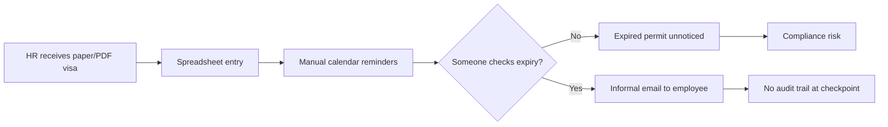

**Pain points:** missed expiry dates, no real-time verification, weak audit trails, uncontrolled access to sensitive data, manual reporting.

### 2.2 To-Be solution (DigiPermit)

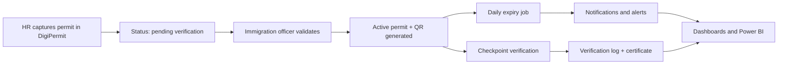

**Outcome:** centralised records, automated expiry monitoring, multi-channel verification, immutable logs, role-based access, filterable analytics.

---

## 3. What the system does — end-to-end

### 3.1 Typical lifecycle (work visa at an employer)

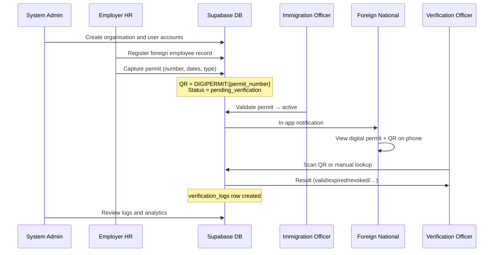

### 3.2 What happens when a permit is captured

1. HR (or university/clinic officer) selects an existing **foreign national** record.  
2. HR enters permit number, type, issue/expiry dates, passport number.  
3. Backend generates:
   - `qr_code_value` = `DIGIPERMIT:{permit_number}`  
   - `rfid_tag` (simulated identifier)  
   - Initial status **`pending_verification`**  
4. Immigration officer (simulated role) **validates** or **rejects** the record.  
5. On validation, status becomes **active** (or **expiring_soon** if near expiry).  
6. **Daily cron job** recalculates statuses and creates **notifications** and **alerts** at configured thresholds (90, 60, 30, 14, 7, 1, 0 days).  

### 3.3 What happens at a checkpoint

1. Verifier opens **Manual Lookup**, **QR Scan**, or **RFID Simulation**.  
2. System loads permit from database and evaluates:
   - Exists? Revoked? Expired? Expiring soon? QR/RFID match?  
3. Returns one of **ten verification result states** (e.g. valid, expired, revoked, not_found, suspicious).  
4. Writes row to **`verification_logs`**; may create **`alerts`** for failed/suspicious scans.  
5. Frontend shows **verification certificate** (PNG/PDF/print).  

---

## 4. How DigiPermit meets Major Project specifications

### 4.1 IS3 — Information Systems 3

| IS3 requirement | How DigiPermit addresses it | Evidence |
|-----------------|----------------------------|----------|
| BPMN As-Is / To-Be process models | Manual spreadsheet process vs automated DigiPermit workflow | [IS3-BPMN-PROCESS-MODELS.md](./IS3-BPMN-PROCESS-MODELS.md), Section 6 below |
| 3NF relational database | 12 normalised tables, FK constraints, no transitive dependencies | [IS3-ERD.md](./IS3-ERD.md), `database/migrations/` |
| Row Level Security | RLS policies on Supabase tables | `database/migrations/013_rls_policies.sql` |
| IoT connectivity map | Simulated devices POST to REST API → verification engine | [IS3-IOT-CONNECTIVITY-MAP.md](./IS3-IOT-CONNECTIVITY-MAP.md), `/api/iot/simulate` |
| Analytics / Power BI | SQL views + REST analytics + filterable Chart.js dashboards | [POWER-BI-SETUP.md](./POWER-BI-SETUP.md), `/api/analytics/*` |
| AI workflow (academic) | Rule-based executive insights endpoint | [IS3-AI-WORKFLOW.md](./IS3-AI-WORKFLOW.md), `/api/analytics/ai-insights` |
| Automated business rule (BPMN) | Daily expiry check job | `src/jobs/expiryCheckJob.js` |

### 4.2 IP2 — Internet Programming 2

| IP2 requirement | How DigiPermit addresses it | Evidence |
|-----------------|----------------------------|----------|
| RESTful API | Express MVC: routes → controllers → services | `digipermit-backend/src/` |
| Authentication & authorisation | Supabase Auth JWT + role middleware | `/api/auth/*`, `roleMiddleware.js` |
| CRUD operations | Full CRUD on organisations, users, FN, permits, alerts | Postman collection |
| Frontend integration | Ionic Angular consumes API with guards | `digipermit-frontend/` |
| API documentation | Open specification + Postman | [API-SPECIFICATION.md](./API-SPECIFICATION.md) |
| Testing | Test plan, role test guide, verify script | [TEST-PLAN.md](./TEST-PLAN.md), [ROLE-USER-STORIES-TEST-GUIDE.pdf](./ROLE-USER-STORIES-TEST-GUIDE.pdf) |

### 4.3 DS3 — Development Software 3

| DS3 requirement | How DigiPermit addresses it | Evidence |
|-----------------|----------------------------|----------|
| Agile / Scrum | 4 sprints with reviews and backlog | [sprints/](./sprints/), [PHASE1-PLANNING-AND-DESIGN.md](./PHASE1-PLANNING-AND-DESIGN.md) |
| Version control | GitHub repository with conventional commits | https://github.com/MrNtuli/DPermit |
| Working increments | Each sprint delivered testable features | Sprint review documents |
| Project documentation | Proposal, report, slides, demo script | [PROJECT-PROPOSAL.md](./PROJECT-PROPOSAL.md), [FINAL-PROJECT-REPORT.md](./FINAL-PROJECT-REPORT.md) |
| Team collaboration | Shared repo, role-based demo walkthrough | [DEMO-SCRIPT.md](./DEMO-SCRIPT.md) |

### 4.4 Objectives mapping (project objectives O1–O7)

| Objective | Implementation | Demonstration |
|-----------|----------------|---------------|
| **O1** Centralise records | Multi-tenant PostgreSQL with org scoping | Admin + HR dashboards |
| **O2** RBAC | 8 roles, route guards, API `authorize()` | Negative test: HR cannot access `/admin` |
| **O3** Expiry automation | Cron job + notifications | Seed permit near expiry; notifications list |
| **O4** Multi-channel verification | Manual, QR, RFID endpoints + UI | Verification officer demo |
| **O5** Suspicious activity | Rule-based alerts | Scan revoked permit; alerts page |
| **O6** Analytics | SQL views, filtered charts, Power BI | Admin analytics filters |
| **O7** End-to-end workflow | HR → FN → verify → immigration → manager | [DEMO-SCRIPT.md](./DEMO-SCRIPT.md) |

---

## 5. System architecture

### 5.1 Three-tier logical architecture

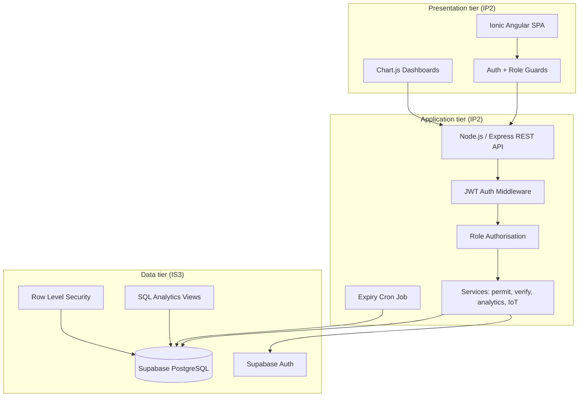

### 5.2 Technology stack

| Layer | Technology | Purpose |
|-------|------------|---------|
| Frontend | Ionic, Angular, TypeScript, SCSS | Mobile-first responsive UI |
| Charts | Chart.js | Live analytics dashboards |
| Backend | Node.js, Express.js | REST API, business logic |
| Database | Supabase PostgreSQL | 3NF data store |
| Authentication | Supabase Auth (JWT) | Secure login |
| Hosting | GitHub Pages + Render | Live demo deployment |
| Analytics export | Power BI + SQL views | Executive reporting (IS3) |
| IoT demo | REST simulation + Packet Tracer map | Academic IoT integration |
| Testing | Postman, manual test guide | IP2 quality assurance |
| Source control | Git / GitHub | DS3 collaboration |

---

## 6. Process diagrams (BPMN-style)

### 6.1 UC-01 — Employer onboarding (core use case)

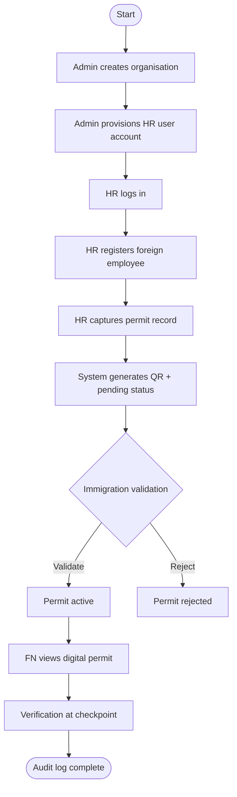

### 6.2 Expiry monitoring (automated BPMN activity)

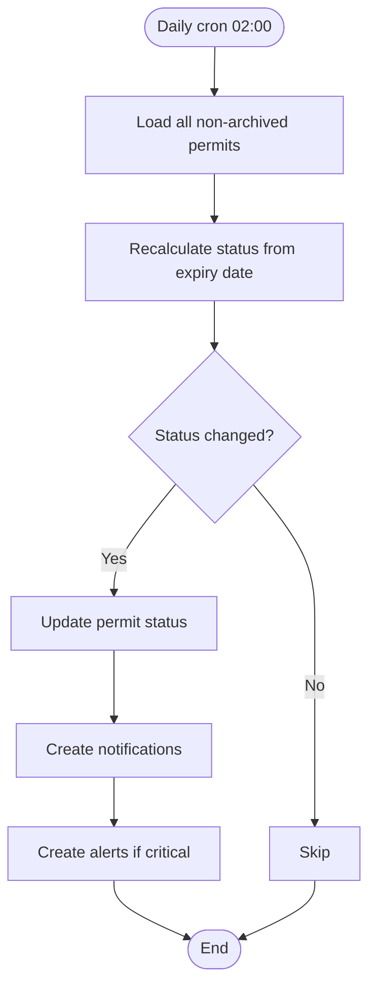

### 6.3 Renewal / update request flow

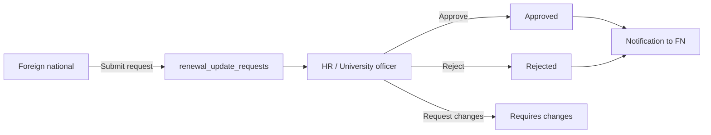

---

## 7. User roles and what happens for each

### 7.1 Role ecosystem

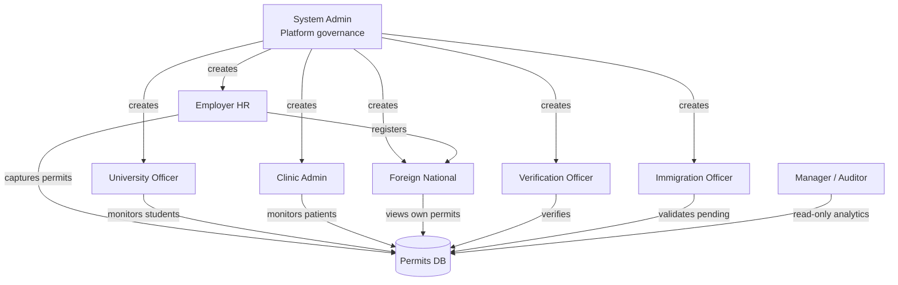

### 7.2 Role summary table

| Role | Primary purpose | Key actions in system |
|------|-----------------|------------------------|
| **System Administrator** | Govern platform | Create orgs/users, view all data, analytics, logs, IoT devices |
| **Employer HR** | Work-visa compliance | Register employees, capture permits, verify (manual/QR), approve renewals |
| **University Officer** | Study-visa compliance | List students/visas, dashboard, verify (manual/QR) |
| **Clinic Administrator** | Patient document monitoring | List patients/permits, verify (manual/QR) |
| **Foreign National** | Self-service | View permits, QR document, notifications, request history |
| **Verification Officer** | Checkpoint | Manual, QR, RFID verification; certificates; logs |
| **Immigration Officer** | Simulated compliance review | Validate/reject pending permits, suspicious activity, alerts |
| **Manager / Auditor** | Executive oversight | Read-only analytics, AI insights report |

**Demo password (all seed users):** `Demo@12345`  
**Full test steps:** [ROLE-USER-STORIES-TEST-GUIDE.md](./ROLE-USER-STORIES-TEST-GUIDE.md)

---

## 8. Verification engine

### 8.1 Verification channels

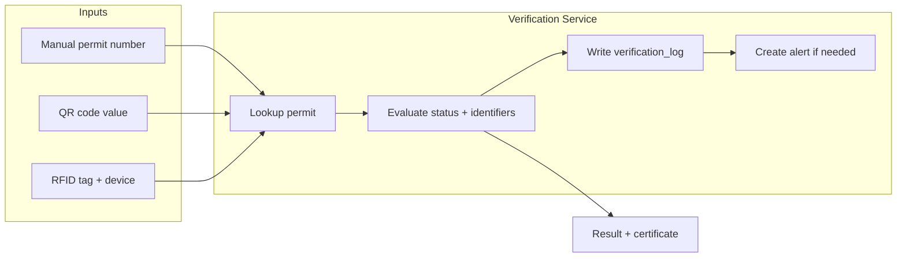

### 8.2 Result states (examples)

| Result | Meaning | Typical trigger |
|--------|---------|-----------------|
| `valid` | Active permit | Active record, before expiry |
| `expiring_soon` | Near expiry | Within threshold window |
| `expired` | Past expiry date | Expiry date passed |
| `revoked` | Administratively revoked | Status = revoked |
| `not_found` | No matching record | Unknown permit/QR |
| `suspicious` | Identifier mismatch | QR/RFID does not match record |

### 8.3 Demo permit numbers

| Permit number | QR value | Expected result |
|---------------|----------|-----------------|
| WP-2024-ACME-001 | DIGIPERMIT:WP-2024-ACME-001 | Valid |
| WP-2023-ACME-003 | DIGIPERMIT:WP-2023-ACME-003 | Expired |
| WP-2024-ACME-004 | DIGIPERMIT:WP-2024-ACME-004 | Revoked |
| SV-2024-METRO-001 | DIGIPERMIT:SV-2024-METRO-001 | Valid |
| MT-2024-CLINIC-001 | DIGIPERMIT:MT-2024-CLINIC-001 | Pending → validate via immigration |

---

## 9. Data model (IS3)

### 9.1 Core entities (12 tables)

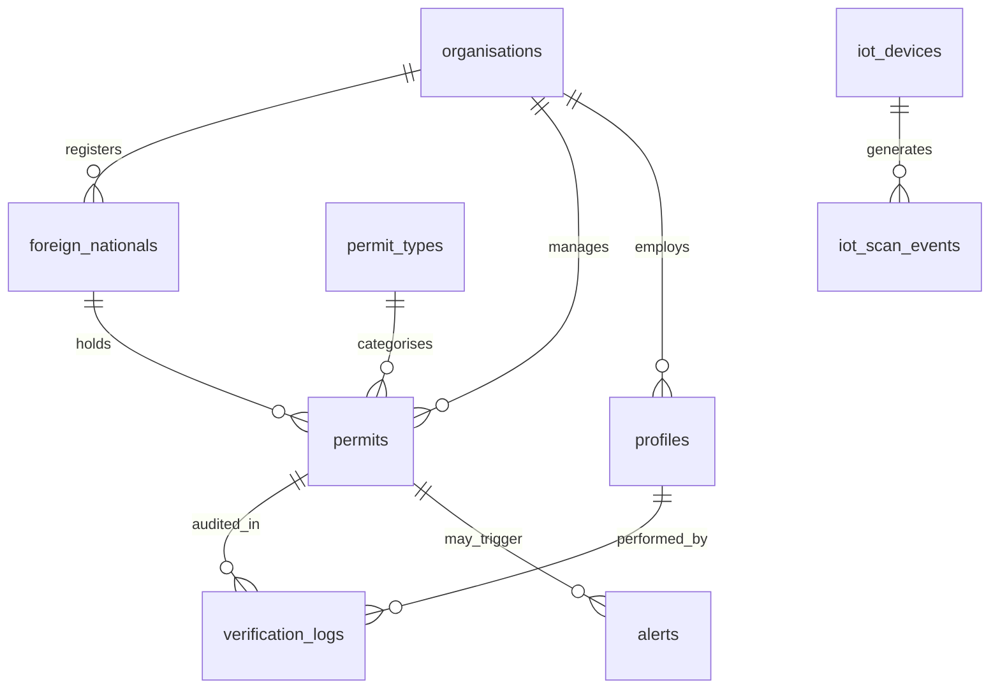

**Full ERD:** [IS3-ERD.md](./IS3-ERD.md)

### 9.2 Multi-tenancy

- Each **organisation** (employer, university, clinic) owns its foreign nationals and permits.  
- HR/university/clinic users see **only their organisation** (enforced in API services + RLS).  
- Admin, manager, immigration (simulated) roles may have broader read access per role rules.  

---

## 10. Analytics and reporting (IS3)

### 10.1 Analytics data flow

```mermaid
flowchart LR
    DB[(PostgreSQL)] --> Views[SQL Views<br/>vw_expiring_permits, etc.]
    DB --> API[/api/analytics/*]
    API --> UI[Chart.js dashboards]
    Views --> PBI[Power BI Desktop]
    API --> AI[/api/analytics/ai-insights]
```

### 10.2 Filterable analytics (lecturer requirement)

Users with analytics access can filter by:

- Organisation (admin/manager/immigration)  
- Period (7 / 14 / 30 / 90 days)  
- Scan type (manual / QR / RFID)  
- Verification result  
- Permit status  
- Alert status  

Filters apply to **charts and KPI cards** simultaneously via `/api/analytics/charts` and `/api/analytics/summary`.

### 10.3 Power BI

SQL views in Supabase connect to Power BI for executive dashboards.  
**Setup guide:** [power-bi/POWER-BI-DASHBOARD-BUILD-GUIDE.md](./power-bi/POWER-BI-DASHBOARD-BUILD-GUIDE.md)

---

## 11. IoT simulation (IS3)

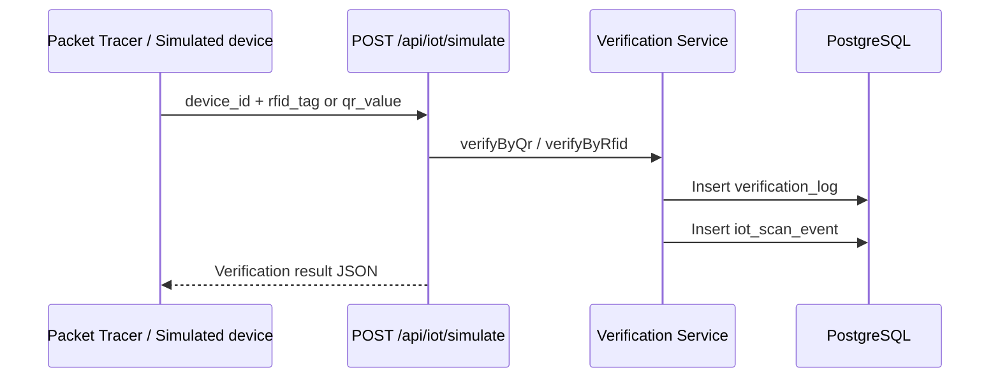

**Connectivity map:** [IS3-IOT-CONNECTIVITY-MAP.md](./IS3-IOT-CONNECTIVITY-MAP.md)  
**Lab guide:** [PACKET-TRACER-LAB-GUIDE.md](./PACKET-TRACER-LAB-GUIDE.md)

---

## 12. API layer (IP2)

### 12.1 API structure

| Group | Base path | Example endpoints |
|-------|-----------|-------------------|
| Auth | `/api/auth` | login, profile |
| Organisations | `/api/organisations` | CRUD (admin) |
| Users | `/api/users` | CRUD (admin) |
| Foreign nationals | `/api/foreign-nationals` | CRUD (org officers) |
| Permits | `/api/permits` | CRUD, validate, reject, revoke |
| Verification | `/api/verify` | manual, QR, RFID |
| IoT | `/api/iot` | simulate, devices, events |
| Analytics | `/api/analytics` | summary, charts, filters, ai-insights |
| Alerts / Notifications | `/api/alerts`, `/api/notifications` | list, resolve, mark read |

**Full specification:** [API-SPECIFICATION.md](./API-SPECIFICATION.md)  
**Postman:** `digipermit-backend/postman/DigiPermit-API.postman_collection.json`

### 12.2 Security model

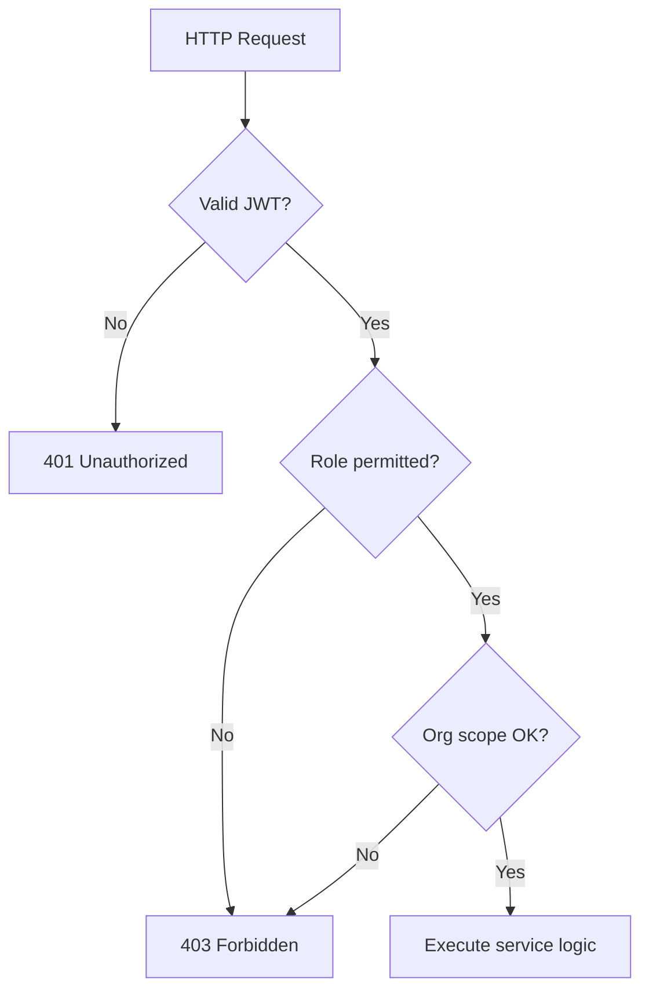

---

## 13. Agile delivery (DS3)

### 13.1 Sprint timeline

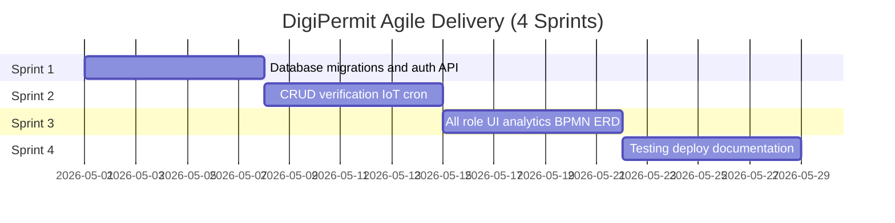

### 13.2 Increment delivered per sprint

| Sprint | Goal | Key deliverable |
|--------|------|-----------------|
| **1** | Backend & database foundation | 12-table schema, auth, org/user API |
| **2** | Core business logic | Verification engine, IoT simulate, expiry job, HR UI |
| **3** | Full UI & IS3 artefacts | 8 role dashboards, charts, BPMN/ERD/IoT docs |
| **4** | Release & presentation | Test guide PDF, live deploy, final report/slides |

**Reviews:** [sprints/SPRINT-1-REVIEW.md](./sprints/SPRINT-1-REVIEW.md) through [SPRINT-4-REVIEW.md](./sprints/SPRINT-4-REVIEW.md)

---

## 14. Testing and quality assurance

| Test type | Artefact | Purpose |
|-----------|----------|---------|
| API testing | Postman collection | IP2 endpoint verification |
| Role acceptance | [ROLE-USER-STORIES-TEST-GUIDE.pdf](./ROLE-USER-STORIES-TEST-GUIDE.pdf) | All 8 roles |
| System smoke test | `scripts/verify-system.ps1` | Health, login, permits, analytics |
| Live deployment | https://mrntuli.github.io/DPermit/ | End-to-end demo |
| Test plan | [TEST-PLAN.md](./TEST-PLAN.md) | Formal IP2 test documentation |

---

## 15. Deployment architecture

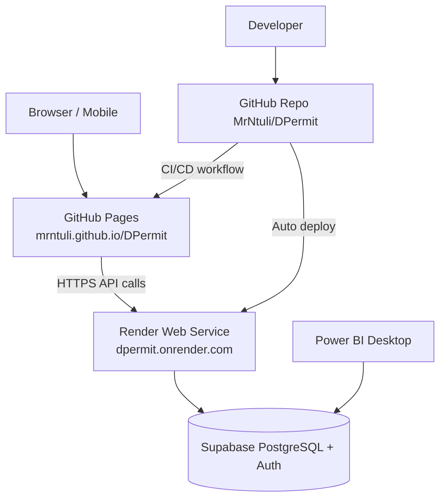

| Component | URL |
|-----------|-----|
| Source code | https://github.com/MrNtuli/DPermit |
| Live frontend | https://mrntuli.github.io/DPermit/ |
| Live API | https://dpermit.onrender.com |
| API health | https://dpermit.onrender.com/api/health |

**Deploy guide:** [DEPLOY.md](./DEPLOY.md)

---

## 16. Known limitations and future work

| Limitation | Rationale | Future enhancement |
|------------|-----------|-------------------|
| Not official immigration issuer | Academic scope | N/A — by design |
| In-app notifications only | Phase 1 scope | Email/SMS integration |
| Simulated IoT / RFID | No hardware in capstone | Real device SDK |
| Admin-provisioned user accounts | Security model | HR invite flow |
| Supporting documents metadata only | No secure file vault | Document upload service |
| Rule-based AI insights | Academic AI layer | ML anomaly detection |
| Free Render tier sleep | Cost | Paid instance for production |

---

## 17. Related documentation index

| Document | Use |
|----------|-----|
| [PHASE1-PLANNING-AND-DESIGN.md](./PHASE1-PLANNING-AND-DESIGN.md) | Full requirements & FR/NFR |
| [PROJECT-PROPOSAL.md](./PROJECT-PROPOSAL.md) | Week 1 proposal |
| [FINAL-PROJECT-REPORT.md](./FINAL-PROJECT-REPORT.md) | 10–15 page submission |
| [PRESENTATION-SLIDE-DECK.md](./PRESENTATION-SLIDE-DECK.md) | Demo presentation |
| [DEMO-SCRIPT.md](./DEMO-SCRIPT.md) | Live demonstration steps |
| [COMPLETE-SETUP-GUIDE.md](./COMPLETE-SETUP-GUIDE.md) | Hosting checklist |
| [CAPSTONE-DELIVERABLES-INDEX.md](./CAPSTONE-DELIVERABLES-INDEX.md) | All module deliverables |

---

**Document prepared for:** Major Project submission — DS3 × IS3 × IP2  
**Team repository:** https://github.com/MrNtuli/DPermit  

**PDF export:** [pdf/MAJOR-PROJECT-SYSTEM-DESCRIPTION.pdf](./pdf/MAJOR-PROJECT-SYSTEM-DESCRIPTION.pdf)  
*Regenerate:* `python scripts/generate-system-description-pdf.py`*
