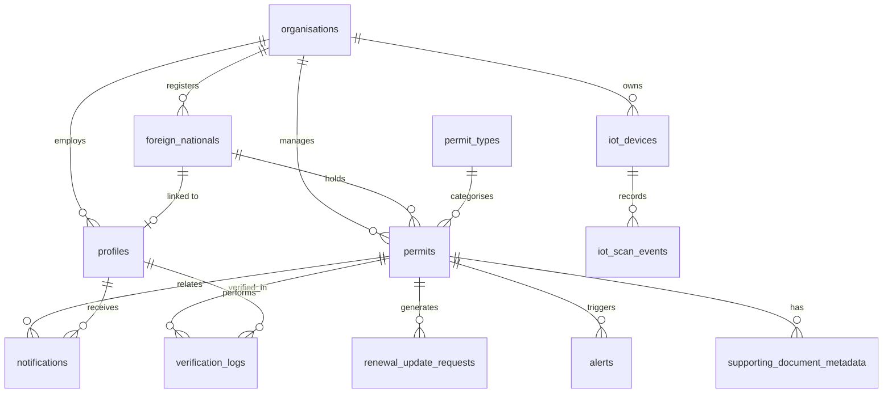

# DigiPermit — Phase 1: Planning and Design

**Project Title:** DigiPermit: A Multi-User Foreign-National Visa and Permit Compliance Monitoring System

**Document Version:** 1.0  
**Date:** 30 May 2026  
**Status:** Awaiting review before Phase 2 (Database Setup)

---

## Important Project Limitation

> DigiPermit is a compliance-monitoring and verification platform. It does not issue official visas or immigration permits, and it does not replace the Department of Home Affairs or any official immigration authority. It helps foreign nationals and authorised organisations monitor document validity, receive expiry reminders, verify records, and maintain compliance logs.

---

## 1. Problem Statement

Foreign nationals living, working, studying, or receiving treatment in a host country often hold multiple immigration-related documents — work visas, study visas, visitor visas, medical-treatment visas, residence permits, and other authorised documentation. Each document carries expiry dates, renewal conditions, and compliance obligations that must be tracked continuously.

In practice, compliance is frequently managed through spreadsheets, email chains, and paper files. This manual approach creates systemic risk:

- **Expiry oversight:** Permit expiry dates are missed by foreign nationals and the organisations responsible for monitoring them.
- **Delayed renewal action:** Foreign nationals may not know when renewal is required until a document has already expired.
- **Employer non-compliance:** Employers may continue engaging foreign workers without realising that captured work-visa records have expired.
- **Institutional gaps:** Universities may fail to identify international students whose study visas are approaching expiry.
- **Verification uncertainty:** Verification officers cannot quickly confirm whether a permit record is valid, expired, revoked, rejected, or suspicious.
- **Poor audit trails:** Verification attempts, alerts, and compliance decisions are not stored in a structured, searchable form.
- **Uncontrolled access:** Different user types may see information beyond their authorised scope.
- **Reporting burden:** Compliance reporting requires time-consuming manual aggregation.

DigiPermit addresses these challenges by providing a secure, role-based digital platform purpose-built for immigration permit and visa **compliance monitoring** — not for issuing official permits. The system supports record capture, expiry tracking, automated notifications, multi-channel verification (permit number, QR code, simulated RFID), audit logging, suspicious-activity detection, dashboards, and analytics.

---

## 2. Project Aim

To design and implement a secure, multi-user web platform that reduces the risk of expired, invalid, revoked, or suspicious immigration permits being overlooked, by enabling foreign nationals and authorised organisations to monitor, verify, and manage compliance records through role-based dashboards, automated alerts, and structured audit trails — while clearly remaining a compliance tool and **not** a substitute for official government immigration systems.

---

## 3. Project Objectives

| # | Objective | Success Indicator |
|---|-----------|-------------------|
| O1 | **Centralise permit compliance records** in a single digital platform with organisation-level data isolation. | All core entities (organisations, foreign nationals, permits, verifications) stored in Supabase PostgreSQL with referential integrity. |
| O2 | **Implement secure role-based access control** across frontend and backend. | Each of the eight defined roles can only perform permitted actions; unauthorised access returns 403. |
| O3 | **Automate expiry monitoring and notifications** at 90, 60, 30, 14, 7, 1, 0, and post-expiry intervals. | Daily scheduled job creates in-app notifications and alerts for affected users. |
| O4 | **Provide multi-channel permit verification** (manual lookup, QR scan, simulated RFID) with clear result states and audit logging. | Every verification returns one of ten defined results and creates a verification log entry. |
| O5 | **Detect and flag suspicious activity** using rule-based logic suitable for an academic project. | Alerts generated for repeated invalid scans, post-revocation usage, QR/RFID mismatches, and duplicate permit numbers. |
| O6 | **Deliver role-specific dashboards and analytics** for operational and read-only oversight roles. | Dashboards display live statistics; SQL views and API endpoints support Power BI integration. |
| O7 | **Demonstrate a complete end-to-end academic workflow** from HR registration through employee self-service, verification, and admin oversight. | Demo script (Section 23 of requirements) executes successfully with seed data. |

---

## 4. Project Scope

### 4.1 In Scope

| Area | Details |
|------|---------|
| **User management** | Eight roles with authentication via Supabase Auth, profile management, activation/deactivation. |
| **Organisation management** | Multi-tenant organisations (employer, university, clinic, etc.) with registration details and status. |
| **Foreign-national records** | Registration, profile linking, organisation association, archival. |
| **Permit management** | Configurable permit types, permit capture, validation workflow, status lifecycle, QR/RFID identifiers. |
| **Verification** | Manual, QR, RFID (simulated), camera-simulation scan types with ten result states. |
| **Notifications & alerts** | Automated expiry reminders, compliance alerts, suspicious-activity alerts, in-app delivery. |
| **Renewal/update requests** | Foreign nationals submit updates; authorised officers review and approve/reject. |
| **Audit & compliance** | Verification logs, IoT scan events, supporting-document metadata (not public file exposure). |
| **Analytics** | Backend analytics endpoints, SQL views, Power BI connection plan. |
| **IoT simulation** | Academic demonstration of scan events via REST API (Cisco Packet Tracer / simulated interface). |
| **Frontend** | Ionic Angular responsive mobile-first UI with route guards and role-based navigation. |
| **Backend** | Node.js / Express REST API with controller-service-route architecture. |
| **Database** | Supabase PostgreSQL with migrations, seeds, RLS policies, and views. |
| **Testing artefacts** | Postman collection, test plan, demo seed data. |

### 4.2 Out of Scope (Initial Release)

| Item | Rationale |
|------|-----------|
| Official permit issuance | Government authority responsibility; explicitly excluded. |
| Real government system integration | Academic simulation only. |
| Production email/SMS delivery | Designed for extension; in-app notifications first. |
| Actual RFID hardware integration | Simulated via API for demonstration. |
| Confidential document file storage/public exposure | Metadata only; no public document serving. |
| AI-assisted analytics (Phase 1) | Optional layer added after rule-based system works. |
| University, clinic, immigration-officer full UI (Phase 1 build priority) | Added after core four roles are stable. |

### 4.3 Build Priority (Phase 1 Implementation Order)

**Roles (first):** System Administrator → Foreign National → Employer HR → Verification Officer

**Permit types (seed):** General work visa, Critical-skills work visa, Study visa, Visitor visa, Permanent-residence permit

**Core features (first):** Authentication, RBAC, foreign-national registration, permit capture, expiry calculation, notifications, permit-number verification, QR verification, verification logs, alerts, dashboard statistics, CRUD operations

---

## 5. Project Limitations

1. **Not an official immigration system.** DigiPermit does not issue, renew, or revoke official government permits. Organisations only capture, monitor, verify, and manage compliance records.
2. **Academic demonstration purpose.** RFID, border-control, and senior compliance-officer roles are simulated for learning and presentation.
3. **In-app notifications only (initially).** Email and SMS are architecturally supported but not implemented in the first working version.
4. **Rule-based suspicious-activity detection.** No machine-learning model in the core release; optional AI summary layer may be added later.
5. **Supporting documents as metadata.** File references are stored; actual secure document vault integration is deferred.
6. **Simulated IoT.** Scan events are API-driven simulations, not live hardware unless extended for presentation.
7. **Fictional data only.** All seed data uses fictional names, passport numbers, and permit numbers.
8. **Single-region deployment assumption.** Multi-region HA and enterprise-scale performance tuning are out of scope for the academic project.
9. **Power BI requires separate setup.** SQL views and API endpoints are provided; the Power BI dashboard is configured by the student separately.

---

## 6. User Roles and Permissions

### 6.1 Role Summary Matrix

| Permission | Sys Admin | Foreign National | Employer HR | University Officer | Clinic Admin | Verification Officer | Immigration Officer | Manager/Auditor |
|------------|:---------:|:----------------:|:-----------:|:------------------:|:------------:|:--------------------:|:-------------------:|:---------------:|
| Manage organisations | ✓ | | | | | | | |
| Manage users/roles | ✓ | | | | | | | |
| Manage permit types | ✓ | | | | | | | |
| Register foreign nationals | ✓ | | ✓ (employer) | ✓ (university) | ✓ (clinic) | | | |
| Capture permit records | ✓ | | ✓ | ✓ | ✓ | | ✓ | |
| View own permits | | ✓ | | | | | | |
| View org-linked records | ✓ | | ✓ | ✓ | ✓ | | ✓ | Read-only |
| Validate/reject/revoke permits | ✓ | | | | | | ✓ | |
| Verify permits (scan/search) | ✓ | | ✓ | ✓ | ✓ | ✓ | ✓ | |
| Submit renewal requests | | ✓ | | | | | | |
| Review renewal requests | ✓ | | ✓ | ✓ | | | ✓ | |
| View notifications | ✓ | ✓ | ✓ | ✓ | ✓ | ✓ | ✓ | ✓ |
| Resolve alerts | ✓ | | ✓ | ✓ | | | ✓ | |
| View analytics/reports | ✓ | | ✓ | ✓ | ✓ | Limited | ✓ | ✓ |
| Export reports | ✓ | | ✓ | ✓ | ✓ | | ✓ | ✓ |
| Edit operational records | ✓ | Own profile only | ✓ (org scope) | ✓ (org scope) | ✓ (org scope) | | ✓ | ✗ |

### 6.2 Role Definitions

#### 6.2.1 System Administrator (`system_admin`)
- **Purpose:** Platform-wide governance.
- **Permissions:** Full CRUD on organisations, users, permit types, all foreign nationals and permits; view/resolve all alerts; global analytics; IoT device management; system settings.
- **Restrictions:** Must still follow audit logging; cannot bypass RLS without service-role backend access.

#### 6.2.2 Foreign National (`foreign_national`)
- **Purpose:** Self-service view of personal immigration compliance records.
- **Permissions:** Personal dashboard, own permits, QR code display, expiry countdown, notifications, submit renewal/update requests, view request history.
- **Restrictions:** Own data only; cannot verify, validate, revoke, or approve permits.

#### 6.2.3 Employer HR / Compliance Officer (`employer_hr`)
- **Purpose:** Monitor foreign employees' work-visa compliance for one employer organisation.
- **Permissions:** Register employees, capture work-visa records, monitor expiry, receive alerts, review renewal requests, verify records, export compliance reports.
- **Restrictions:** Employer-scoped data only; does not issue official permits.

#### 6.2.4 University International-Office Officer (`university_officer`)
- **Purpose:** Monitor international students' study-visa compliance.
- **Permissions:** Register students, capture study-visa records, monitor expiry, alerts, renewal review, verification, reports.
- **Restrictions:** University-scoped data only; does not issue official visas.

#### 6.2.5 Clinic / Hospital Administrator (`clinic_admin`)
- **Purpose:** Capture and monitor immigration-document records for foreign patients/employees.
- **Permissions:** Register foreign nationals, capture records, monitor validity, notifications, verification, institution reports.
- **Restrictions:** Clinic-scoped data only; does not issue official permits.

#### 6.2.6 Verification Officer (`verification_officer`)
- **Purpose:** Point-of-check permit verification (simulated border/security context).
- **Permissions:** Search by permit number, scan QR, simulate RFID, view verification result, add optional note, view recent verification activity.
- **Restrictions:** Minimum necessary information only; cannot edit, approve, or revoke permits.

#### 6.2.7 Immigration / Senior Compliance Officer (`immigration_officer`)
- **Purpose:** Academic simulation of compliance review authority.
- **Permissions:** Review pending records, validate/reject/revoke/mark suspicious, view document metadata, resolve alerts, high-risk case review, compliance reports.
- **Restrictions:** Simulated role — not presented as Department of Home Affairs replacement.

#### 6.2.8 Manager / Auditor (`manager`, `auditor`)
- **Purpose:** Read-only oversight and reporting.
- **Permissions:** Dashboards, statistics, expiry trends, alerts, verification trends, suspicious activity, export reports.
- **Restrictions:** No edit access to operational records.

---

## 7. Functional Requirements

### FR-1 Authentication and Authorisation
| ID | Requirement |
|----|-------------|
| FR-1.1 | Users shall register and log in via Supabase Authentication. |
| FR-1.2 | The system shall assign each user a role and optional organisation. |
| FR-1.3 | The backend shall validate JWT tokens on every protected API request. |
| FR-1.4 | The frontend shall use Angular route guards to restrict page access by role. |
| FR-1.5 | Users shall be able to log out and view their profile. |

### FR-2 Organisation Management
| ID | Requirement |
|----|-------------|
| FR-2.1 | System Administrators shall create, view, update, deactivate, and archive organisations. |
| FR-2.2 | Each organisation shall have type, registration number, contact details, and status. |
| FR-2.3 | Organisation users shall only access data linked to their organisation. |

### FR-3 User and Profile Management
| ID | Requirement |
|----|-------------|
| FR-3.1 | Administrators shall create user profiles linked to Supabase Auth accounts. |
| FR-3.2 | Administrators shall assign roles and activate/deactivate users. |
| FR-3.3 | Users shall update their own profile information where permitted. |

### FR-4 Foreign-National Management
| ID | Requirement |
|----|-------------|
| FR-4.1 | Authorised officers shall register foreign nationals linked to an organisation. |
| FR-4.2 | The system shall store passport number, nationality, contact details, and foreign-national type. |
| FR-4.3 | Foreign nationals shall be linkable to user profiles for self-service login. |
| FR-4.4 | Records shall support archival without destroying audit history. |

### FR-5 Permit Type Management
| ID | Requirement |
|----|-------------|
| FR-5.1 | Permit types shall be stored in a configurable database table (not hard-coded in frontend). |
| FR-5.2 | Administrators shall create, edit, deactivate, and view permit categories. |
| FR-5.3 | The system shall seed initial permit types on first deployment. |

### FR-6 Permit Record Management
| ID | Requirement |
|----|-------------|
| FR-6.1 | Authorised users shall capture permit records with issue/expiry dates, status, and identifiers. |
| FR-6.2 | Each permit shall have a unique permit number and generated QR code value. |
| FR-6.3 | Immigration officers shall validate, reject, or revoke permits with reasons. |
| FR-6.4 | The system shall calculate and display expiry countdowns. |
| FR-6.5 | Permit statuses shall follow the defined lifecycle (active → expiring_soon → expired, etc.). |

### FR-7 Verification
| ID | Requirement |
|----|-------------|
| FR-7.1 | Verification officers shall verify permits by number, QR code, or simulated RFID tag. |
| FR-7.2 | The backend shall compute verification results (valid, expired, revoked, suspicious, etc.). |
| FR-7.3 | Verification results shall mask passport numbers and expose minimum personal data. |
| FR-7.4 | Every verification shall create a verification log entry. |
| FR-7.5 | Mismatched QR/RFID values shall trigger suspicious-activity alerts. |

### FR-8 Notifications and Alerts
| ID | Requirement |
|----|-------------|
| FR-8.1 | A daily job shall check permit expiry dates and create notifications at defined intervals. |
| FR-8.2 | Users shall view and mark notifications as read. |
| FR-8.3 | The system shall auto-create alerts for expired/revoked/rejected scans and suspicious activity. |
| FR-8.4 | Authorised users shall resolve alerts with audit trail. |

### FR-9 Renewal and Update Requests
| ID | Requirement |
|----|-------------|
| FR-9.1 | Foreign nationals shall submit renewal/update requests with notes and proposed dates. |
| FR-9.2 | Organisation officers and immigration officers shall approve, reject, or request changes. |
| FR-9.3 | Request status shall be visible to the submitter. |

### FR-10 IoT Simulation
| ID | Requirement |
|----|-------------|
| FR-10.1 | Simulated devices shall POST scan events to the IoT API. |
| FR-10.2 | Each scan shall trigger verification logic and store an IoT scan event. |
| FR-10.3 | Administrators shall register IoT devices per organisation. |

### FR-11 Analytics and Reporting
| ID | Requirement |
|----|-------------|
| FR-11.1 | The system shall expose analytics REST endpoints for dashboards. |
| FR-11.2 | SQL views shall support Power BI connection for permit, verification, and alert summaries. |
| FR-11.3 | Authorised roles shall export compliance reports. |

### FR-12 Dashboards
| ID | Requirement |
|----|-------------|
| FR-12.1 | Each role shall have a tailored dashboard displaying relevant KPIs and recent activity. |
| FR-12.2 | Admin dashboard shall include charts for permit status, expiry forecast, and verification activity. |

---

## 8. Non-Functional Requirements

### NFR-1 Security
| ID | Requirement |
|----|-------------|
| NFR-1.1 | All secrets and connection strings shall be stored in environment variables. |
| NFR-1.2 | Supabase Row Level Security shall enforce organisation and self-service data isolation. |
| NFR-1.3 | Passport numbers shall be masked in verification responses (e.g., `AB***789`). |
| NFR-1.4 | Input validation shall be applied on all API endpoints. |
| NFR-1.5 | Supporting documents shall not be publicly accessible. |

### NFR-2 Performance
| ID | Requirement |
|----|-------------|
| NFR-2.1 | API responses for single-record lookups shall complete within 2 seconds under demo load. |
| NFR-2.2 | Database indexes shall be applied to frequently queried columns (permit_number, expiry_date, organisation_id). |

### NFR-3 Usability
| ID | Requirement |
|----|-------------|
| NFR-3.1 | The frontend shall be responsive and mobile-first (Ionic). |
| NFR-3.2 | The UI shall provide loading states, error messages, empty states, and toast feedback. |
| NFR-3.3 | Verification results shall be clearly labelled with colour-coded status badges. |

### NFR-4 Reliability and Auditability
| ID | Requirement |
|----|-------------|
| NFR-4.1 | Verification logs and alerts shall be immutable once created (no hard delete). |
| NFR-4.2 | Soft deletion/archiving shall preserve historical audit records. |
| NFR-4.3 | The daily expiry job shall be idempotent (no duplicate notifications for the same threshold). |

### NFR-5 Maintainability
| ID | Requirement |
|----|-------------|
| NFR-5.1 | The backend shall follow controller → service → route separation. |
| NFR-5.2 | SQL changes shall be versioned in migration files. |
| NFR-5.3 | API shall be documented via Postman collection. |

### NFR-6 Compatibility
| ID | Requirement |
|----|-------------|
| NFR-6.1 | Frontend shall target modern browsers and mobile WebViews via Ionic. |
| NFR-6.2 | Analytics views shall be compatible with Power BI PostgreSQL connector. |

### NFR-7 Scalability (Academic Baseline)
| ID | Requirement |
|----|-------------|
| NFR-7.1 | Architecture shall support multiple organisations as tenants without code changes. |
| NFR-7.2 | Permit types shall be data-driven to allow growth without redeployment. |

---

## 9. Use Cases

### UC-01: HR Registers Foreign Employee and Captures Work Visa
| Field | Description |
|-------|-------------|
| **Actor** | Employer HR Officer |
| **Precondition** | HR is logged in and linked to an employer organisation. |
| **Main Flow** | 1. HR navigates to "Add Foreign Employee". 2. Enters employee details (name, passport, nationality, etc.). 3. System creates foreign-national record linked to employer. 4. HR captures work-visa permit details (type, number, dates). 5. System generates QR code value and sets status to `pending_verification`. 6. System confirms successful capture. |
| **Postcondition** | Employee record and permit exist; immigration officer may validate. |
| **Alternative** | Duplicate passport number → system shows validation error. |

### UC-02: Foreign National Views Permit and QR Code
| Field | Description |
|-------|-------------|
| **Actor** | Foreign National |
| **Precondition** | User account is linked to a foreign-national record with at least one permit. |
| **Main Flow** | 1. Employee logs in. 2. Views personal dashboard with permit summary. 3. Opens permit details page. 4. Sees expiry countdown and status badge. 5. Opens QR code page displaying scannable code. |
| **Postcondition** | Employee is informed of permit status and expiry timeline. |
| **Restriction** | User cannot see other foreign nationals' data. |

### UC-03: Verification Officer Verifies Permit by Number
| Field | Description |
|-------|-------------|
| **Actor** | Verification Officer |
| **Precondition** | Officer is logged in with verification role. |
| **Main Flow** | 1. Officer enters permit number on verification page. 2. Backend searches permit record. 3. Backend evaluates status, expiry, and suspicious-activity rules. 4. System returns result (e.g., Valid, Expired, Revoked). 5. System creates verification log. 6. Officer views result with masked passport and warning if applicable. |
| **Postcondition** | Verification log stored; alert created if result warrants it. |
| **Alternative** | Permit not found → result = `not_found`; alert may be created for repeated failures. |

### UC-04: QR Code Verification with Mismatch Detection
| Field | Description |
|-------|-------------|
| **Actor** | Verification Officer |
| **Precondition** | Permit exists with stored `qr_code_value`. |
| **Main Flow** | 1. Officer scans QR code (or enters QR value). 2. System finds permit by number embedded in QR payload. 3. System compares scanned value to stored value. 4. If match and permit valid → result = `valid`. 5. If mismatch → result = `suspicious`; alert created. |
| **Postcondition** | Verification log records scan type = `qr`. |

### UC-05: Daily Expiry Notification Job
| Field | Description |
|-------|-------------|
| **Actor** | System (scheduled job) |
| **Precondition** | Active permits exist with future or past expiry dates. |
| **Main Flow** | 1. Job runs daily at configured time. 2. Queries permits matching notification thresholds (90/60/30/14/7/1/0 days, post-expiry). 3. Creates in-app notifications for foreign national and linked org officers. 4. Updates permit status to `expiring_soon` or `expired` where applicable. 5. Creates escalation alerts for high-risk cases. |
| **Postcondition** | Stakeholders receive timely reminders; no duplicate notifications for same threshold. |

### UC-06: Foreign National Submits Renewal Update Request
| Field | Description |
|-------|-------------|
| **Actor** | Foreign National |
| **Precondition** | Permit exists; user owns the record. |
| **Main Flow** | 1. User opens "Submit Update Request". 2. Selects permit and request type. 3. Enters new expiry date and notes. 4. System creates request with status `pending`. 5. HR/university officer receives notification. |
| **Postcondition** | Request awaits review; permit status may change to `renewal_in_progress`. |

### UC-07: Immigration Officer Validates Pending Permit
| Field | Description |
|-------|-------------|
| **Actor** | Immigration / Senior Compliance Officer |
| **Precondition** | Permit has status `pending_verification`. |
| **Main Flow** | 1. Officer views pending permits queue. 2. Reviews captured details and supporting-document metadata. 3. Clicks Validate. 4. System sets `verification_status` to validated, records validator and timestamp. 5. Permit status becomes `active`. 6. Foreign national receives notification. |
| **Alternative** | Officer rejects → status = `rejected`; reason recorded. |
| **Postcondition** | Permit lifecycle updated with audit trail. |

### UC-08: System Administrator Monitors Platform Alerts
| Field | Description |
|-------|-------------|
| **Actor** | System Administrator |
| **Precondition** | Alerts exist from verifications and expiry checks. |
| **Main Flow** | 1. Admin logs in to global dashboard. 2. Views unresolved alert count and recent verification activity. 3. Opens alerts page filtered by priority. 4. Reviews alert details (expired scan, suspicious QR, etc.). 5. Resolves or escalates alert. |
| **Postcondition** | Alert marked resolved with resolver and timestamp. |

### UC-09: Simulated RFID IoT Scan
| Field | Description |
|-------|-------------|
| **Actor** | IoT Simulator / Verification Officer |
| **Precondition** | IoT device registered; permit has `rfid_tag` value. |
| **Main Flow** | 1. Simulator POSTs to `/api/iot/simulate` with device ID, RFID tag, scan type. 2. Backend locates permit by RFID tag. 3. Verification logic runs. 4. IoT scan event and verification log created. 5. Dashboard statistics updated. |
| **Postcondition** | Academic demonstration of IoT-to-backend integration complete. |

### UC-10: Manager Views Read-Only Compliance Analytics
| Field | Description |
|-------|-------------|
| **Actor** | Manager / Auditor |
| **Precondition** | User has read-only manager or auditor role. |
| **Main Flow** | 1. Manager opens analytics dashboard. 2. Views permit trends, expiry forecast, verification statistics. 3. Filters alerts by priority. 4. Exports summary report. |
| **Postcondition** | Oversight data consumed without modifying operational records. |
| **Restriction** | All edit actions are hidden/disabled. |

---

## 10. Entity-Relationship Diagram (Written Description)

### 10.1 Entities and Attributes

**organisations** — Central tenant entity. Attributes: id (PK), name, organisation_type, registration_number, email, phone_number, address, status, created_at, updated_at. Represents employers, universities, clinics, and other authorised bodies.

**profiles** — Application user linked to Supabase Auth. Attributes: id (PK), auth_user_id (FK → auth.users, unique), organisation_id (FK → organisations, nullable), foreign_national_id (FK → foreign_nationals, nullable), full_name, email, phone_number, role (enum), status, timestamps. One profile per auth user; optional links to organisation and foreign-national identity.

**foreign_nationals** — Person holding immigration documents. Attributes: id (PK), passport_number (unique), full_name, date_of_birth, nationality, email, phone_number, current_address, organisation_id (FK → organisations), foreign_national_type (enum), status, timestamps.

**permit_types** — Configurable catalogue of visa/permit categories. Attributes: id (PK), name, description, category, is_active, timestamps. Referenced by permits; admin-managed.

**permits** — Core compliance record. Attributes: id (PK), permit_number (unique), foreign_national_id (FK), permit_type_id (FK), organisation_id (FK), passport_number, issue_date, expiry_date, qr_code_value, rfid_tag, status (enum), verification_status, captured_by (FK → profiles), validated_by (FK → profiles), validated_at, revocation_reason, timestamps.

**renewal_update_requests** — Foreign-national-initiated change requests. Attributes: id (PK), permit_id (FK), foreign_national_id (FK), organisation_id (FK), request_type (enum), notes, new_expiry_date, status (enum), reviewed_by (FK → profiles), reviewed_at, timestamps.

**notifications** — In-app user notifications. Attributes: id (PK), profile_id (FK), permit_id (FK, nullable), title, message, notification_type, priority, is_read, created_at.

**verification_logs** — Immutable audit of verification attempts. Attributes: id (PK), permit_id (FK, nullable), verified_by (FK → profiles), organisation_id (FK), scan_type (enum), verification_result (enum), verification_note, device_id, ip_address, created_at.

**alerts** — Compliance and suspicious-activity alerts. Attributes: id (PK), permit_id (FK, nullable), foreign_national_id (FK, nullable), organisation_id (FK), alert_type, priority, message, status, resolved_by (FK → profiles), resolved_at, created_at.

**supporting_document_metadata** — Document references without public file exposure. Attributes: id (PK), permit_id (FK), foreign_national_id (FK), document_type, file_reference, uploaded_by (FK → profiles), verification_status, timestamps.

**iot_devices** — Registered simulation devices. Attributes: id (PK), organisation_id (FK), device_name, device_type, device_identifier (unique), status, timestamps.

**iot_scan_events** — IoT demonstration event log. Attributes: id (PK), device_id (FK), organisation_id (FK), scan_type, permit_number, rfid_tag, verification_result, created_at.

### 10.2 Relationships

```
organisations 1 ──< M profiles
organisations 1 ──< M foreign_nationals
organisations 1 ──< M permits
organisations 1 ──< M iot_devices
organisations 1 ──< M alerts
organisations 1 ──< M verification_logs

foreign_nationals 1 ──< M permits
foreign_nationals 1 ──< O..1 profiles  (optional link for self-service login)
foreign_nationals 1 ──< M renewal_update_requests
foreign_nationals 1 ──< M alerts

permit_types 1 ──< M permits

permits 1 ──< M renewal_update_requests
permits 1 ──< M notifications
permits 1 ──< M verification_logs
permits 1 ──< M alerts
permits 1 ──< M supporting_document_metadata

profiles 1 ──< M notifications
profiles 1 ──< M verification_logs (as verified_by)
profiles 1 ──< M permits (as captured_by, validated_by)

iot_devices 1 ──< M iot_scan_events
```

### 10.3 Key Constraints
- **Unique:** permit_number, passport_number (foreign_nationals), auth_user_id (profiles), device_identifier (iot_devices).
- **Check constraints:** role enums, status enums, scan_type enums, expiry_date >= issue_date.
- **Referential integrity:** ON DELETE RESTRICT for permits and foreign_nationals; SET NULL where audit history must survive profile archival.
- **RLS:** Organisation-scoped SELECT/INSERT/UPDATE policies; foreign-national self-access on own records; admin bypass via service role on backend.

### 10.4 Conceptual ERD (Mermaid)



---

## 11. System Architecture

### 11.1 Three-Tier Architecture

```
┌─────────────────────────────────────────────────────────────────┐
│                    PRESENTATION LAYER                           │
│  Ionic Angular (TypeScript, SCSS, HTML)                         │
│  • Pages & Components  • Route Guards  • API Services           │
│  • Role-based Navigation  • QR Scanner UI  • Dashboards         │
└────────────────────────────┬────────────────────────────────────┘
                             │ HTTPS / REST (JSON)
                             │ Authorization: Bearer JWT
┌────────────────────────────▼────────────────────────────────────┐
│                   BUSINESS LOGIC LAYER                          │
│  Node.js + Express.js                                           │
│  • Routes → Controllers → Services                              │
│  • Auth Middleware  • RBAC Middleware  • Validators             │
│  • Verification Engine  • Suspicious-Activity Rules             │
│  • Notification Job (node-cron)  • IoT Simulation Handler       │
│  • Analytics Aggregators                                        │
└────────────────────────────┬────────────────────────────────────┘
                             │ Supabase Client (service role)
                             │ + Anon key for auth verification
┌────────────────────────────▼────────────────────────────────────┐
│                      DATA LAYER                                   │
│  Supabase PostgreSQL                                            │
│  • 12 Core Tables  • FK Constraints  • Indexes                  │
│  • Row Level Security  • SQL Views (Power BI)                   │
│  • Migration & Seed Scripts                                       │
│  Supabase Auth (auth.users)                                       │
└─────────────────────────────────────────────────────────────────┘

External Tools (not in runtime path):
  Postman → API testing
  Power BI → Analytics visualisation (reads views/API)
  GitHub → Version control
  Jira → Project management
  Cisco Packet Tracer → IoT simulation demo (HTTP to API)
```

### 11.2 Request Flow (Example: Permit Verification)

1. Verification Officer submits permit number from Ionic app.
2. Angular HTTP interceptor attaches Supabase JWT.
3. Express `authMiddleware` validates token with Supabase.
4. `authorize(['verification_officer', ...])` checks role.
5. `verificationController` delegates to `verificationService`.
6. Service queries `permits` table; runs expiry, status, QR/RFID match, and suspicious-activity rules.
7. Service inserts `verification_logs` row; creates `alerts` if needed.
8. Service returns structured result DTO with masked passport.
9. Frontend displays result page with status badge and timestamp.

### 11.3 Security Architecture

| Layer | Mechanism |
|-------|-----------|
| Authentication | Supabase Auth (email/password); JWT in Authorization header |
| Frontend authorisation | Angular `AuthGuard`, `RoleGuard` |
| Backend authorisation | `authMiddleware` + `roleMiddleware` per route |
| Data isolation | Supabase RLS policies on organisation_id and foreign_national_id |
| Secrets | `.env` files (never committed); `.env.example` templates |
| Audit | verification_logs, alerts, immutable timestamps |

### 11.4 Scheduled Jobs

| Job | Schedule | Responsibility |
|-----|----------|----------------|
| `expiryCheckJob` | Daily (e.g., 06:00 UTC) | Update permit statuses; create notifications and alerts |

---

## 12. Proposed Folder Structure

### 12.1 Repository Root

```text
DPermit/
├── docs/
│   ├── PHASE1-PLANNING-AND-DESIGN.md    ← this document
│   ├── ERD-diagram.png                   ← (optional export)
│   ├── API-SPECIFICATION.md              ← Phase 3
│   ├── DEMO-SCRIPT.md                    ← Phase 6
│   └── POWER-BI-SETUP.md                 ← Phase 5
├── digipermit-backend/
│   ├── src/
│   │   ├── config/
│   │   │   ├── supabase.js
│   │   │   └── env.js
│   │   ├── controllers/
│   │   │   ├── authController.js
│   │   │   ├── organisationController.js
│   │   │   ├── userController.js
│   │   │   ├── foreignNationalController.js
│   │   │   ├── permitTypeController.js
│   │   │   ├── permitController.js
│   │   │   ├── verificationController.js
│   │   │   ├── renewalController.js
│   │   │   ├── notificationController.js
│   │   │   ├── alertController.js
│   │   │   ├── iotController.js
│   │   │   └── analyticsController.js
│   │   ├── middleware/
│   │   │   ├── authMiddleware.js
│   │   │   ├── roleMiddleware.js
│   │   │   ├── validateMiddleware.js
│   │   │   └── errorHandler.js
│   │   ├── routes/
│   │   │   ├── authRoutes.js
│   │   │   ├── organisationRoutes.js
│   │   │   ├── userRoutes.js
│   │   │   ├── foreignNationalRoutes.js
│   │   │   ├── permitTypeRoutes.js
│   │   │   ├── permitRoutes.js
│   │   │   ├── verificationRoutes.js
│   │   │   ├── renewalRoutes.js
│   │   │   ├── notificationRoutes.js
│   │   │   ├── alertRoutes.js
│   │   │   ├── iotRoutes.js
│   │   │   └── analyticsRoutes.js
│   │   ├── services/
│   │   │   ├── authService.js
│   │   │   ├── organisationService.js
│   │   │   ├── userService.js
│   │   │   ├── foreignNationalService.js
│   │   │   ├── permitTypeService.js
│   │   │   ├── permitService.js
│   │   │   ├── verificationService.js
│   │   │   ├── renewalService.js
│   │   │   ├── notificationService.js
│   │   │   ├── alertService.js
│   │   │   ├── iotService.js
│   │   │   ├── analyticsService.js
│   │   │   └── suspiciousActivityService.js
│   │   ├── validators/
│   │   │   └── *.validator.js
│   │   ├── utils/
│   │   │   ├── maskPassport.js
│   │   │   ├── qrGenerator.js
│   │   │   ├── expiryCalculator.js
│   │   │   └── apiResponse.js
│   │   ├── jobs/
│   │   │   └── expiryCheckJob.js
│   │   ├── app.js
│   │   └── server.js
│   ├── database/
│   │   ├── migrations/
│   │   │   ├── 001_create_organisations.sql
│   │   │   ├── 002_create_profiles.sql
│   │   │   ├── ... (through 012)
│   │   │   └── 013_rls_policies.sql
│   │   ├── seeds/
│   │   │   ├── 001_permit_types.sql
│   │   │   ├── 002_organisations.sql
│   │   │   ├── 003_users_profiles.sql
│   │   │   └── 004_demo_data.sql
│   │   └── views/
│   │       ├── vw_permit_status_summary.sql
│   │       ├── vw_expiring_permits.sql
│   │       ├── vw_verification_summary.sql
│   │       ├── vw_alert_summary.sql
│   │       ├── vw_employer_compliance.sql
│   │       ├── vw_university_compliance.sql
│   │       └── vw_iot_scan_summary.sql
│   ├── tests/
│   ├── postman/
│   │   └── DigiPermit-API.postman_collection.json
│   ├── .env.example
│   ├── package.json
│   └── README.md
├── digipermit-frontend/
│   ├── src/
│   │   ├── app/
│   │   │   ├── components/
│   │   │   │   ├── sidebar/
│   │   │   │   ├── header/
│   │   │   │   ├── status-badge/
│   │   │   │   ├── expiry-countdown/
│   │   │   │   └── qr-display/
│   │   │   ├── guards/
│   │   │   │   ├── auth.guard.ts
│   │   │   │   └── role.guard.ts
│   │   │   ├── interceptors/
│   │   │   │   └── auth.interceptor.ts
│   │   │   ├── interfaces/
│   │   │   │   ├── user.interface.ts
│   │   │   │   ├── permit.interface.ts
│   │   │   │   └── ...
│   │   │   ├── layouts/
│   │   │   │   └── main-layout/
│   │   │   ├── pages/
│   │   │   │   ├── auth/
│   │   │   │   ├── admin/
│   │   │   │   ├── foreign-national/
│   │   │   │   ├── employer/
│   │   │   │   ├── verification/
│   │   │   │   └── shared/
│   │   │   ├── services/
│   │   │   │   ├── auth.service.ts
│   │   │   │   ├── api.service.ts
│   │   │   │   └── ...
│   │   │   ├── shared/
│   │   │   └── app.routes.ts
│   │   ├── assets/
│   │   ├── environments/
│   │   │   ├── environment.ts
│   │   │   └── environment.prod.ts
│   │   └── theme/
│   ├── package.json
│   └── README.md
├── .gitignore
└── README.md
```

---

## 13. Jira Backlog

### Epic 1: Project Setup and Infrastructure
| Task ID | Task | Priority |
|---------|------|----------|
| DP-1 | Create GitHub repository with monorepo structure | High |
| DP-2 | Configure `.gitignore`, branch strategy (`main`, `develop`, feature branches) | High |
| DP-3 | Create Supabase project and document connection details | High |
| DP-4 | Set up Jira project with epics and sprints | Medium |
| DP-5 | Write root README with setup overview and limitation statement | Medium |

### Epic 2: Database Design and Implementation
| Task ID | Task | Priority |
|---------|------|----------|
| DP-10 | Write migration `001–012` for all core tables | High |
| DP-11 | Add check constraints, unique constraints, and indexes | High |
| DP-12 | Implement RLS policies for all tables | High |
| DP-13 | Create analytics SQL views (7 views) | Medium |
| DP-14 | Write seed scripts for permit types, organisations, users, demo data | High |
| DP-15 | Test migrations and seeds in Supabase SQL editor | High |

### Epic 3: Backend — Authentication and Core API
| Task ID | Task | Priority |
|---------|------|----------|
| DP-20 | Initialise Node.js/Express project with folder structure | High |
| DP-21 | Configure Supabase client and environment variables | High |
| DP-22 | Implement auth middleware and auth routes (signup, login, logout, profile) | High |
| DP-23 | Implement role-based authorisation middleware | High |
| DP-24 | Implement organisation CRUD endpoints | High |
| DP-25 | Implement user/profile CRUD endpoints | High |
| DP-26 | Implement foreign-national CRUD endpoints | High |
| DP-27 | Implement permit-type CRUD endpoints | High |
| DP-28 | Implement permit CRUD + validate/reject/revoke/archive | High |
| DP-29 | Add input validation and global error handler | High |
| DP-30 | Create Postman collection for all endpoints | Medium |

### Epic 4: Backend — Verification, Notifications, and Jobs
| Task ID | Task | Priority |
|---------|------|----------|
| DP-40 | Implement verification service (manual, QR, RFID logic) | High |
| DP-41 | Implement suspicious-activity detection rules | High |
| DP-42 | Implement verification log endpoints | High |
| DP-43 | Implement notification endpoints | High |
| DP-44 | Implement alert endpoints (create auto, resolve) | High |
| DP-45 | Implement daily expiry-check cron job | High |
| DP-46 | Implement renewal/update request workflow endpoints | Medium |
| DP-47 | Implement IoT simulation endpoints | Medium |
| DP-48 | Implement analytics endpoints | Medium |

### Epic 5: Frontend — Foundation
| Task ID | Task | Priority |
|---------|------|----------|
| DP-50 | Initialise Ionic Angular project | High |
| DP-51 | Configure environments and API base URL | High |
| DP-52 | Implement AuthService and auth interceptor | High |
| DP-53 | Implement AuthGuard and RoleGuard | High |
| DP-54 | Build main layout (sidebar, mobile menu, header) | High |
| DP-55 | Build landing, login, signup, forgot-password pages | High |
| DP-56 | Build shared components (status badge, countdown, loading, empty states) | Medium |

### Epic 6: Frontend — Core Role Pages (Priority Roles)
| Task ID | Task | Priority |
|---------|------|----------|
| DP-60 | System Admin dashboard and global statistics | High |
| DP-61 | Admin: organisations, users, permit types CRUD pages | High |
| DP-62 | Admin: alerts, verification logs, all permits | High |
| DP-63 | Foreign National: dashboard, my permits, QR page, notifications | High |
| DP-64 | Foreign National: submit update request, request history | Medium |
| DP-65 | Employer HR: dashboard, register employee, capture permit | High |
| DP-66 | Employer HR: expiry alerts, renewal requests, reports | Medium |
| DP-67 | Verification Officer: verification dashboard, manual/QR/RFID pages | High |
| DP-68 | Verification Officer: result page and recent logs | High |

### Epic 7: Frontend — Extended Roles
| Task ID | Task | Priority |
|---------|------|----------|
| DP-70 | University officer pages (students, study visas, alerts) | Medium |
| DP-71 | Clinic admin pages | Medium |
| DP-72 | Immigration officer review pages | Medium |
| DP-73 | Manager/auditor read-only analytics dashboard | Medium |

### Epic 8: IoT, Analytics, and Reporting
| Task ID | Task | Priority |
|---------|------|----------|
| DP-80 | IoT simulation page and device management UI | Medium |
| DP-81 | Admin IoT scan events page | Medium |
| DP-82 | Dashboard charts (permit status, expiry forecast, verifications) | Medium |
| DP-83 | Power BI connection guide and view validation | Medium |
| DP-84 | Export/report functionality | Low |

### Epic 9: Testing, Documentation, and Demo
| Task ID | Task | Priority |
|---------|------|----------|
| DP-90 | Write test plan and Postman test scripts | High |
| DP-91 | Role-access test matrix execution | High |
| DP-92 | End-to-end demo script validation (23 steps) | High |
| DP-93 | Final README setup instructions for markers/examiners | High |
| DP-94 | Presentation script and slide outline | Medium |

---

## 14. GitHub Repository Plan

### 14.1 Repository Naming
**Suggested name:** `digipermit` or `DPermit`  
**Visibility:** Private during development; public if academic submission requires.

### 14.2 Branch Strategy

| Branch | Purpose |
|--------|---------|
| `main` | Stable, demo-ready releases |
| `develop` | Integration branch for completed features |
| `feature/DP-XX-description` | Individual Jira task work |
| `fix/DP-XX-description` | Bug fixes |

### 14.3 Commit Convention
Use conventional commits aligned with Jira IDs:
```
feat(backend): DP-28 add permit validate endpoint
fix(frontend): DP-67 correct QR scanner result binding
docs: DP-5 add project limitation to README
chore(db): DP-14 add demo seed data
```

### 14.4 Repository Contents at Milestones

| Milestone | Tag | Contents |
|-----------|-----|----------|
| M1 — Planning Complete | `v0.1.0-planning` | `/docs`, README, `.gitignore` |
| M2 — Database Ready | `v0.2.0-database` | `/database` migrations, seeds, views |
| M3 — Backend Core | `v0.3.0-backend-core` | Auth, CRUD, verification API |
| M4 — Frontend Core | `v0.4.0-frontend-core` | 4 priority roles UI |
| M5 — Full Demo | `v1.0.0-demo` | Complete system with seed data and demo script |

### 14.5 `.gitignore` Essentials
```
node_modules/
.env
.env.local
dist/
www/
.angular/
*.log
.DS_Store
```

### 14.6 GitHub Features to Use
- **Issues:** Linked to Jira task IDs (or GitHub Issues mirroring Jira).
- **Projects board:** Columns: Backlog → In Progress → Review → Done.
- **Releases:** Tagged milestones with changelog.
- **Wiki (optional):** Demo credentials and examiner quick-start.

---

## 15. Step-by-Step Development Roadmap

### Phase 1: Planning and Design ✅ (Current)
**Duration:** 1 week  
**Deliverables:** This document — problem statement, objectives, scope, requirements, ERD, architecture, backlog, repo plan.  
**Gate:** Review and approve before coding.

---

### Phase 2: Database Setup
**Duration:** 1–2 weeks  
**Steps:**
1. Create Supabase project; note URL, anon key, service role key.
2. Write and run migration files for all 12 tables in dependency order.
3. Add indexes on `permit_number`, `expiry_date`, `organisation_id`, `auth_user_id`.
4. Implement RLS policies (organisation isolation, foreign-national self-access, admin policies).
5. Create 7 analytics SQL views.
6. Run seed scripts: permit types → organisations → profiles → foreign nationals → permits → logs/alerts/notifications.
7. Verify relationships and constraints in Supabase Table Editor.
8. Document ERD diagram export and relationship notes.

**Exit criteria:** All tables populated with demo data; RLS tested with sample queries.

---

### Phase 3: Backend Setup
**Duration:** 2–3 weeks  
**Steps:**
1. `npm init` Express project; install dependencies (`express`, `@supabase/supabase-js`, `cors`, `dotenv`, `node-cron`, `express-validator`, `uuid`, `qrcode`).
2. Configure Supabase client (service role for backend operations).
3. Implement auth middleware (JWT verification) and role middleware.
4. Build routes/controllers/services one group at a time:
   - Auth → Organisations → Users → Foreign Nationals → Permit Types → Permits
   - Verification → Notifications → Alerts → Renewal → IoT → Analytics
5. Implement verification engine and suspicious-activity service.
6. Implement daily expiry cron job.
7. Create Postman collection; test each endpoint group.
8. Write backend README with `.env.example`.

**Exit criteria:** All API endpoints pass Postman tests with seed-data users.

---

### Phase 4: Frontend Setup
**Duration:** 3–4 weeks  
**Steps:**
1. `ionic start digipermit-frontend blank --type=angular`.
2. Configure environments, API service, auth service, interceptor.
3. Implement guards and role-based sidebar navigation.
4. Build shared layout and auth pages.
5. **Role iteration 1:** System Administrator pages.
6. **Role iteration 2:** Foreign National pages (dashboard, permits, QR, notifications).
7. **Role iteration 3:** Employer HR pages (register employee, capture permit, alerts).
8. **Role iteration 4:** Verification Officer pages (manual, QR, RFID, result).
9. Add toast, loading, validation, empty/error states throughout.

**Exit criteria:** Demo flow steps 1–16 executable from UI.

---

### Phase 5: IoT, Analytics, and Reporting
**Duration:** 1–2 weeks  
**Steps:**
1. Build IoT simulation page and admin device management.
2. Integrate dashboard charts (Chart.js or similar).
3. Connect Power BI to Supabase views; build sample dashboard.
4. Add university, clinic, immigration officer, manager pages.
5. Implement export/report buttons.
6. Optional: AI-assisted alert summary layer.

**Exit criteria:** Demo steps 17–23 complete; Power BI shows live view data.

---

### Phase 6: Testing and Presentation
**Duration:** 1 week  
**Steps:**
1. Execute full test plan (CRUD, RBAC, verification, notifications, IoT).
2. Fix defects; re-run demo script.
3. Finalise README with setup commands, demo credentials, limitation statement.
4. Prepare presentation script and screenshots.
5. Tag `v1.0.0-demo` release on GitHub.

**Exit criteria:** All 23 demo steps pass; documentation complete for submission.

---

## Appendix A: Technology Stack Summary

| Layer | Technology |
|-------|------------|
| Frontend | Ionic, Angular, TypeScript, SCSS |
| Backend | Node.js, Express.js, REST |
| Database | Supabase PostgreSQL |
| Auth | Supabase Authentication |
| Security | RLS, JWT, RBAC middleware, route guards |
| Testing | Postman |
| Analytics | Power BI + SQL views |
| IoT Demo | REST simulation (+ optional Cisco Packet Tracer) |
| Version Control | GitHub |
| Project Management | Jira |

---

## Appendix B: Verification Result States

| Result | Condition |
|--------|-----------|
| `valid` | Active, validated, not expired |
| `expiring_soon` | Within configured threshold days of expiry |
| `expired` | Past expiry date |
| `revoked` | Status = revoked |
| `rejected` | Status = rejected |
| `pending_verification` | Awaiting compliance officer validation |
| `renewal_in_progress` | Renewal request in progress |
| `suspicious` | QR/RFID mismatch or suspicious-activity rule triggered |
| `archived` | Record archived |
| `not_found` | No matching permit |

---

## Appendix C: Demo Seed Personas (Planned)

| Persona | Role | Organisation |
|---------|------|--------------|
| Admin User | system_admin | — |
| Sarah Compliance | immigration_officer | Immigration-office simulation |
| John HR | employer_hr | Acme Corp (Employer) |
| Maria Student | foreign_national | Metro University |
| James Worker | foreign_national | Acme Corp |
| Dr. Lin | clinic_admin | City Clinic |
| Officer Chen | verification_officer | — |
| Audit Manager | manager | — |

*(Fictional names and credentials to be defined in Phase 2 seed scripts.)*

---

**End of Phase 1 Document**

*Next step after review: Proceed to Phase 2 — Database Setup (SQL migrations, RLS, seeds, views).*
